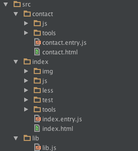
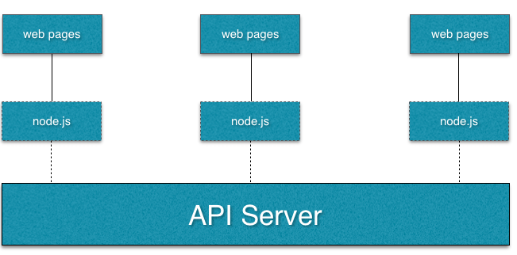

#基于gulp+webpack的"约定大于配置"的构建方案探讨

这不到半年的时间，玩了很多东西。有些觉得不错的新技术，直接拿到公司的项目里去挖坑。感觉进步很大，但是看看工程，啥都有。单看模块管理，从遗留的requirejs，到我过来改用的browserify，以及现在的es6 module，都有，乱糟糟的感觉。然后有天老大发现：现在发布，前端的构建时间比后端好长。重新做构建方案已经变成了一个自己想做，又有可能升值加薪的事~~

##运行demo

##假设与前提
我非常推崇`分治`的开发方式。我改了一个页面，对其他页面最好不要产生任何影响。开发环境也可以单独针对某个页面，不需要去编译打包其他页面的东西。这就要求，除了一些基本不会改变的公用js框架，js库，公用样式，以及logo图片之类的东西，其他的代码，每个页面的代码完全独立，最高从文件夹层面的分离。这样的话，比如有个页面，如果不再需要，直接把文件夹删就ok了。

`demo`的目录结构是这样的

两个页面，一个index，一个contact。各自需要的所有代码，资源文件，全在自己的目录。公用的东西在lib里。

所以这里假设的`构建方案`是：

1. 多个页面，每个页面相互独立，只打包自己的东西。如果页面不要了，直接删了文件就ok。

2. 开发时，只构建自己的东西，因为如果项目有20，30个页面，我现在只开发index，打包、watch其他页面的代码，会影响我的开发效率。

3. 发布的时候，全量构建.

4. 构建的文件路径映射，给出`map.json`(我命名为assets-map.json)文件，供路径解析用。

##约定大于配置
有使用后端开发框架的同学，应该都知道这个说法。只要按照一定的约定去写代码，框架会帮你做一个自动的处理。比如以文件名以`controller`结尾的,是控制器，然后对应的路由会自动生成等。

很早之前就在想，能不能前端也有`约定大于配置`的构建方案。我觉得各大公司肯定有相应的方案，但是我没见到。我希望一套方案，直接拿过去，npm一下，按照相应的约定去写，构建自动完成。

这里托`webpack`的福，能比较容易的做出我满意的方案。`webpack`以模块为设计出发点，所有资源都当成模块,css,js,图片,模版文件等等。

>// webpack is a module bundler.

// This means webpack takes modules with dependencies

// and emits static assets representing those modules.

所以实际上，我需要知道每个页面的入口文件，就能自动构建每个页面的所有代码和资源。（这么一说，我好像什么也不用做-_-!）。然后配合gulp，去动态生成一下东西。gulp + webpack的基本玩法就是 配置一个基础的webpackConfig，gulp的task里，根据需要，动态微调基本的webpackConfig。

##具体使用
首先看代码怎么写。既然`分治`了，那么先只看`index`文件夹。目录结构说明如下：

	index
		img   -- 文件夹。是人都知道这个文件夹干嘛
		js    -- 文件夹。所以
		less  -- 文件夹。就不侮辱大家的智商
		test  -- 一些测试，这里偷懒，里面啥也没有
		tools -- 开发环境工具
		index.entry.js -- 入口文件
		
规定所以入口文件都是`*.entry.js`，这就是唯一的约定(后面构建时，会找出所以这样命名规则的文件)。当然主要是webpack做了太多的工作。

看一下`index.entry.js`的代码

	import ReactDom from 'react-dom'
	import IndexComponent from './js/IndexComponent.js'

	import './less/index.less'

	ReactDom.render(
    	(
        	

            	<IndexComponent/>
            	

        	

    	),
    	document.getElementById('mount-dom')
	)

	setTimeout(function(){
    	require.ensure([],function(){
        	require('./js/async.js')
    	})
	},1000)
	
使用`es6`语法，先各种`import`引入依赖（注意`react`和`react-dom`会放到`lib`里，后面说）。包括js，less，`setTimeout`模拟按需异步加载js文件。其中`index.less`里有样式引用img里的图片

	//index.less的代码
	.avatar{
  		background:url(../img/touxiang.jpg) no-repeat;
  		height: 100px;
  		width: 100px;
  		background-size: 100%;
	}
	
执行完构建后，`assets\dist下`，你会看到
	
	//[hash]为文件的hash，这里写成占位符。
	index.entry-[hash].js
	index.entry-[hash].css	
	img/[hash].jpg 	
	
在`assets\assets-map.json`,有路径的映射。
	
##单个页面实现
对webpack熟悉的同学，应该会觉得这很普通。

	entry: {'/index.entry':"./assets/src/index/index.entry.js"},
    output: {
        filename: "[name]-[chunkhash].js",
        chunkFilename:'[name].js',
        path: __dirname + "/dist",
        libraryTarget:'umd',
        sourceMapFilename:'[name].map',
        publicPath:''
    },
    externals:{
    	'react': {
            root: 'React',
            commonjs2: 'react',
            commonjs: 'react',
            amd: 'react'
        },
        'jquery': {
            root: 'jQuery',
            commonjs2: 'jquery',
            commonjs: 'jquery',
            amd: 'jquery'
        }
    }
    module: {
        loaders: [
            {
                test: /[\.jsx|\.js ]$/,
                exclude: /node_modules/,
                loader: "babel-loader?stage=0&optional[]=runtime"
            },
            {
                test: /\.css$/,
                loader: ExtractTextPlugin.extract('style-loader', 'css-loader')
            },
            {
                test: /\.less$/,
                loader: ExtractTextPlugin.extract('style-loader', 'css-loader!postcss-loader!less-loader')
            },
            { test: /\.(png|jpg|gif)$/, loader: 'file-loader?name=img/[hash].[ext]' }
        ]
    },
    devtool:'source-map',
    plugins: [
        new ExtractTextPlugin("[name].css"),
        new webpack.optimize.UglifyJsPlugin({
            mangle: {
                except: ['$', 'exports', 'require']
            }
        }),
        assetsPluginInstance
    ],

都是些常用的配置和插件，有几点需要的注意的地方

1. output的`filename`要有`[chunkhash]`,使用`[hash]`的话，不同的entry文件，会是同一个`hash`.原因看[文档](https://webpack.github.io/docs/long-term-caching.html)
2. 使用了`assets-webpack-plugin`生成文件的路径映射。
3. `externals`把公用的库排除掉。公用库会去生成`lib.js`,`lib.css`

##多个页面实现
那多个页面，怎么去实现一起构建呢。
上面的`entry`里配置项里只有一个`index.entry`,如果有两个当然就生成两个页面的代码和资源。类似这样

	{ 
	'/contact.entry': './assets/src/contact/contact.entry.js',
  	'/index.entry': './assets/src/index/index.entry.js'
  	}
  	
还记得我们的约定吗（说着有点怪。。），有点感觉了吗。选出来所以`*.entry.js`文件，稍作处理就好了。

	var entries = {}

    var entryFiles = glob.sync('assets/src/**/*.entry.js');

    for(var i = 0;i<entryFiles.length;i++){
        var filePath = entryFiles[i];
        key = filePath.substring(filePath.lastIndexOf(path.sep),filePath.lastIndexOf('.'))
        entries[key] = path.join(__dirname,filePath);
    }

    var config = _.merge({},webpackConfig)
    config.entry=entries

上面的代码就是生成一个键值对(key-value pair)，`key`形如 `/*.entry`,value是入口文件的路径。生成完了，设置给`config.entry`.

##lib的处理
lib实际上就是把上面`exteranls`里的东西，统一打个包。
看gulpfile.js 里的`lib` task,就是把`external`设成`{}`.

`lib.js`的代码

	import React from 'react'
	import jQuery from 'jquery'
	import ReactDOM from 'react-dom'

	import './reset.less'

	window.React = React
	window.jQuery = jQuery
	window.$ = jQuery
	window.ReactDOM = ReactDOM

就是把之前排除掉公共的东西，都import进来，另外加点全局的样式。

为啥不用`CommonsChunkPlugin`？因为这些东西很明显是属于lib的，不用每次都去构建不需要构建的代码。

=====

======= 华丽的分隔线 ======

====

这里的分隔线，实际上，基本的构建已经完成了。对照下上面说的4点

>1.多个页面，每个页面相互独立，只打包自己的东西。如果页面不要了，直接删了文件就ok。

index 和 contact的所有东西都是独立的。这点没问题。

>2.开发时，只构建自己的东西，因为如果项目有20，30个页面，我现在只开发index，打包、watch其他页面的代码，会影响我的开发效率。

开发环境后面说

>3.发布的时候，全量构建.
发布包括：发布lib.js，发布所有页面的静态文件。gulp的`default` task先执行`lib` task，然后自己打包所有页面的资源。

>4.构建的文件路径映射，给出`map.json`(我命名为assets-map.json)文件，供路径解析用。
已经有了，在/assets/assets-map.json里。

但是光构建完，成果都没看见。

##关于assets-map.json
这里有个细节注意一下，`assets-webpack-plugin`这个插件，默认是把json文件覆盖掉的。对于本demo，`lib`和其他是分开，`lib`先执行,所以默认`lib`相关的路径映射会被覆盖。不覆盖有两个条件

1. 设置属性`{update:true}`
2. 同一个插件实例

代码如下：

    var AssetsPlugin = require('assets-webpack-plugin');
    
    var assetsPluginInstance = new AssetsPlugin({filename:'assets/assets-map.json',update: true,prettyPrint: true})
    
    //然后配置里，plugins加入assetsPluginInstance，这样gulp lib task 和 default task里的assetsPluginInstance是同一个对象。
    
有了这个映射文件，就可以自动生成路径了。

	//getStatic.js 可以直接执行node getStatic.js看结果。
	
	//执行gulp后，生成assets/assets-map.json后，执行下面的命令
    var fs =require('fs')
    var path = require('path')
    var fileContent = fs.readFileSync(path.join(__dirname,'assets/assets-map.json'))
    var assetsJson = JSON.parse(fileContent);
    
    function getStatic(resourcePath){
        var lastIndex = resourcePath.lastIndexOf('.')
        var name = resourcePath.substr(0,lastIndex),
            suffix = resourcePath.substr(lastIndex+1);
        if(name in assetsJson){
            return assetsJson[name][suffix]
        }else{
            return resourcePath;
        }
    }
    
    console.log(getStatic('/lib.js'))
    console.log(getStatic('/index.entry.css'))	

以express + jade 为例

	app.locals.getStatic = function(path){
		if(isProdction){
			return getStatic(path) 
		}else{
			//开发环境，return localPath..
		}
	}
	
然后模板里这样使用。

	script(src=getStatic('/lib.js'))
		
##写点html

就是不需要套页面，页面加载后，在通过`ajax`去生成界面。我们这里没有ajax，意思一下。

难点只有一个，就是路径的问题。找`webpack`的插件吧。这里使用：`html-webpack-plugin`.

	 for(var i in entries){
        config.plugins.push(new HtmlWebpackPlugin({
            filename:(i +'.html').replace('entry.',''),//index.entry => index.html
            template: './assets/webpack-tpl.html',//模板文件路径，里面把lib设置好。
            inject: true,
            chunks:[i] //只注入当前的chunk，index.html注入index.entry
        }))
    }
 
对每一个HtmlWebpackPlugin，只能生成一个html，我们有多entry,所以有多个HtmlWebpackPlugin。上面的配置都有说明，另外可以看文档。

##考虑前端分离
现在的前端项目是和后端一起的。在一起的好处，就是发布都扔给他们了。但是你的构建方案一般要收到一些约束，而且使用新技术的时候，很可能会本限制（比如GraphQL）。所以首先想把前端项目拆出来。

分离出来话，有两种方案：

1. `模板 + ajax`。

	首屏有`loading`提醒的情况下，用户体验尚可。而且理论上，甚至可以做到完全静态化，既html也是静态的。这样开完完成后，nginx直接指到相关目录，就ok了。我写的demo为了简单，就是全静态化的。
	
2. `node做api中间层`
最简单的情况就是node做个api代理，然后顺便可以简单的套个首屏页面。当然加这一层会给前端几乎无限的可能性。你可以实现自己的缓存策略，对感兴趣的数据进行统计（因为api转接，所以用户请求的数据以及返回的数据，都能拿到。）等。就是工作量略有上升，另外要肩负node运维的职责。node挂了怎么办；升级怎么保证不间断服务等。

另外拆出来不是放到一个工程下，而且分成若干工程。这也和我们的实际情况有关，我们现在有七八个相对独立的项目，一下全重构也不现实。

另外这也与`分治思想`相契合.

